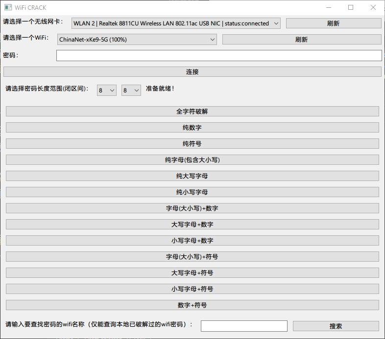

# 项目初衷

之前学习网络渗透相关知识，发现很有挑战性也很有趣。常见的wifi密码破解套路有路由器PIN码暴力破解或者利用路由器漏洞最后通过QSS连接，又或者查弱密码字典撞车。需要虚拟机和一些特定网卡（8187或者3070）才能玩转，条件不允许。写个windows和linux跨平台的查字典撞车小工具消遣一下。

# 实现细则

## 文件

- get_any_length_dict_to_crack_code.py

用于返回包含不同字符类型的惰性计算的字典生成器或者非惰性列表

- backup_json.py

用于破解的备份密码

- wifi_util.py

用于获取wifi名称和强度列表

- WifiControl.py(class WifiControl)

用于获取无线网卡信息，选择无线网卡，及控制断开和连接wifi

- main.py

主程序逻辑，wxpython界面绘制等

## 描述

界面使用wxpython实现。支持扫描无线网卡和指定网卡。支持wifi列表更新，支持个人wifi密钥连接。支持指定密码字符组合类型及指定密码长度破解的方式。支持已破解的wifi密码保存备份。支持按wifi名称搜索已经破解的wifi密码。

字典使用惰性生成器，在需要密码的时候才生成，减少内存占用，即使64位的字典也能在性能孱弱的设备上运行。
字典有大小写字母+数字+特殊符号、纯数字、纯符号、纯字母(大小写)、纯大写字母、纯小写字母、字母(大小写)+数字、大写字母+数字、小写字母+数字、字母+符号、大写字母+符号、小写字母+符号、数字+符号总计15中组合方式，方便在知道密码组合的前提下快速破解，一般情况下选择全字符破解就可以。

功能实现有：个人wifi连接、密码破解、密码查找。都采用开辟一个新线程执行的方式，防止这些耗时流程将UI界面阻塞。

# 使用细则

<p align="center"> <div align="middle"></div></p>


# 求助


有没有对这块熟悉的大佬指点迷津，如何实现连接成功或失败立刻返回，而不是粗暴的sleep等待，这样会降低密码破解的效率

```
wifi = pywifi.PyWiFi()
# 获取第一个无线网卡接口
iface_ = wifi.interfaces()[0]
iface_.connect(tmp_profile)
# 等待...（如果等待时间过短，就会导致早返回，从而误判密码）
            time.sleep(3)
# 检查连接状态
if self.iface_.status() == const.IFACE_CONNECTED:
	return True
else:
	return False
```

<!-- 程序正常执行的情况下，还是会抛出线程异常 -->

# 自行编译

## window

```
pip install -r requirements.txt
pip install update pyinstaller
pyinstaller --onefile --noconsole main.py --name crackwifi
```

## linux

适配中...敬请期待